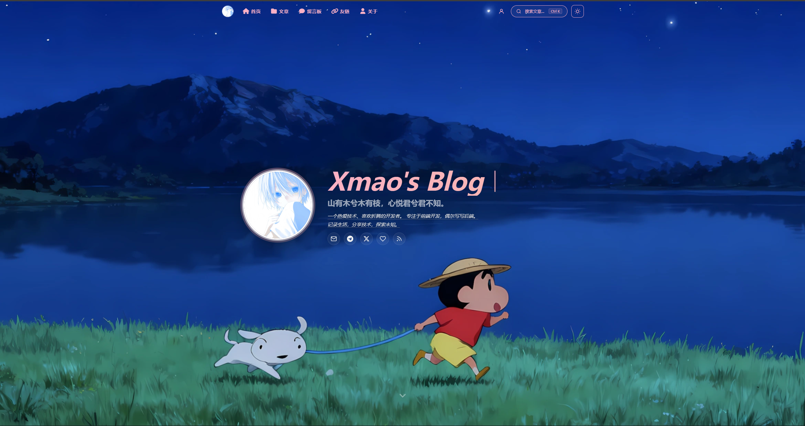
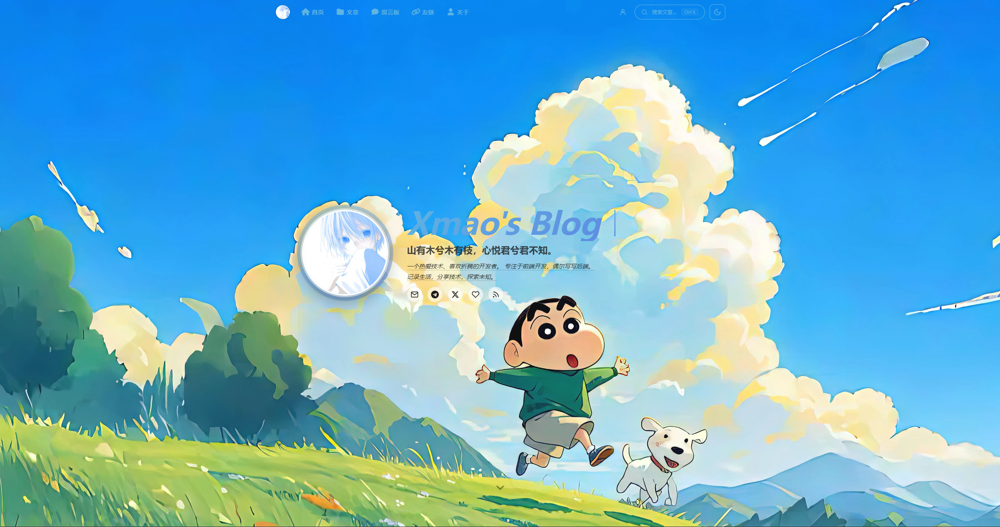
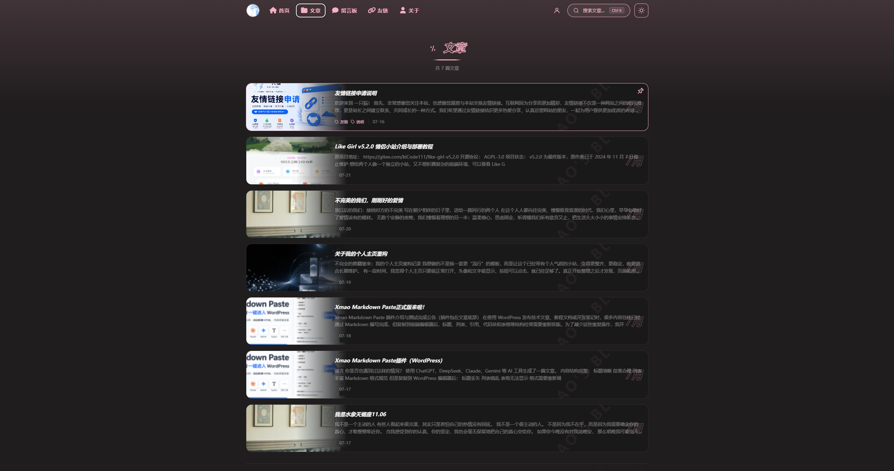
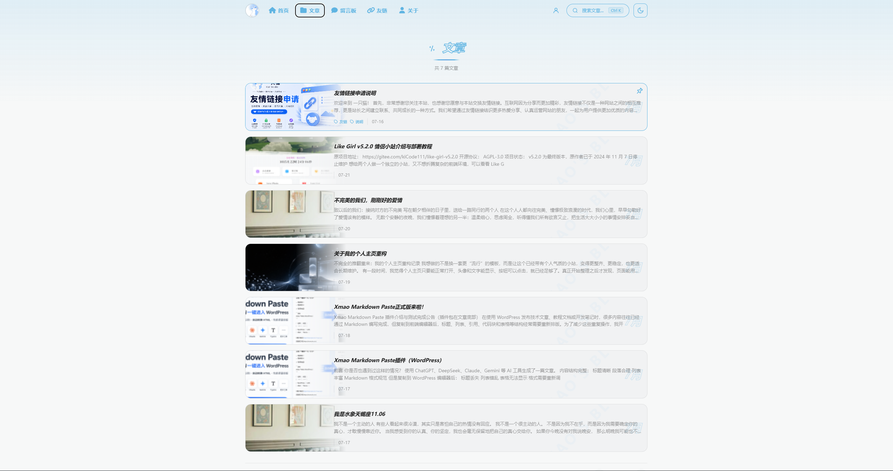

 
 

# 🌸 theme-Serenity-Xmao

**基于 Serenity 二次开发的 Halo 2.x 博客主题**

*以樱花粉与湖水蓝为主色调，支持亮暗模式自由切换*

 

&nbsp;&nbsp;

 

[二次开发说明](#二次开发说明) · [主要修改](#主要修改内容) · [预览截图](#-预览) · [功能特性](#-功能特性) · [安装使用](#-安装使用) · [页面配置](#%EF%B8%8F-页面配置)

 

---

## 二次开发说明

本项目是基于 **Serenity 开发的 Halo 博客主题**进行的二次开发版本，并非从零开发。原主题提供了基础页面结构、视觉系统、亮暗模式、后台配置及多数页面能力；本项目在此基础上完成了 Xmao 品牌信息、主题标识和友链申请功能等定制。

- 原项目：[atangccc/Serenity-Grace](https://github.com/atangccc/Serenity-Grace)
- 应用市场：[Serenity-Grace（Halo 应用市场）](https://www.halo.run/store/apps/app-ltmkjavf)
- 二次开发主题：`theme-Xmao`
- 二次开发者：Xmao
- 适用平台：Halo 2.x
- 开源协议：GPL-3.0

使用或继续修改本项目时，请保留上游来源、本项目二次开发说明及 GPL-3.0 许可证声明。

## 主要修改内容

相较于上游 Serenity 主题，本项目目前主要完成了以下修改：

- 将主题显示名称、作者信息、内部主题 ID、配置名称及站点信息调整为 Xmao 版本。
- 使用 Xmao 提供的图片替换主题详情图标，并同步相关资源路径。
- 在友链页面增加本站 ICP 备案信息展示。
- 将友链头像地址统一输出为可直接使用的完整 URL。
- 支持点击单项复制“名称、描述、链接、头像、ICP”。
- 增加“一键复制全部信息”，并保持复制内容与页面字段顺序一致。
- 适配 Link Submit 友链申请插件，保留插件提交入口，并提供后台启用开关。
- 调整友链申请按钮尺寸、颜色与交互状态，使其匹配现有主题风格。
- 增加“本站信息 / 申请流程 / 申请要求”分区布局，并保留原有提交与复制按钮。
- 增加友链申请的 HTTPS、内容合规、原创维护、本站友链前置添加等审核要求。
- 优化友链申请区域的桌面端双栏和移动端单栏响应式布局。

---

## 预览

<table>
  <tr>
    <td align="center"><strong>🌙 暗色模式</strong></td>
    <td align="center"><strong>☀️ 亮色模式</strong></td>
  </tr>
  <tr>
    <td></td>
    <td></td>
  </tr>
  <tr>
    <td></td>
    <td></td>
  </tr>
  <tr>
    <td></td>
    <td></td>
  </tr>
</table>

---

## 功能特性

### 视觉与交互

| 特性 | 描述 |
|:-----|:-----|
| 双色模式 | 暗色 / 亮色自由切换，支持跟随系统偏好，切换时带圆形扩散动画（View Transition API） |
| 主题色配置 | 后台可视化配置亮色 / 暗色主题色，切换模式时带渐变过渡 |
| 全端适配 | 响应式布局，桌面端、平板、手机全面适配，移动端各页面独立优化 |
| 丝滑滚动 | Lenis 全局惯性缓动，锚点跳转和返回顶部均为平滑滚动 |
| 入场动画 | AOS 滚动入场动画，元素随滚动渐入视野 |
| 欢迎页 | 首次访问全屏欢迎页，可配置吉祥物形象和自定义语录 |
| 过渡动画 | 页面切换淡入淡出效果，浏览体验流畅自然 |
| 指针样式 | 自定义指针样式，提升交互沉浸感 |

### 页面模板

<table>
  <tr>
    <th width="120">模板</th>
    <th>功能亮点</th>
  </tr>
  <tr>
    <td> <strong>首页</strong></td>
    <td>Hero 区域（头像、打字机标题、背景壁纸/视频）· 风向标导航 · 近期笔记 · 站点动态 · 随想碎片轮播 · 生活回想滑块 · 天气时钟</td>
  </tr>
  <tr>
    <td> <strong>文章详情</strong></td>
    <td>封面 Hero · 浮动目录导航（自适应高度）· 阅读进度条 · 相关文章推荐 · 版权声明 · 社交分享 · 打赏组件 · 背景壁纸</td>
  </tr>
  <tr>
    <td> <strong>归档</strong></td>
    <td>文章卡片列表 · 侧边栏（一言、热门文章、最新评论、标签云）· 置顶文章标识 · 分页</td>
  </tr>
  <tr>
    <td> <strong>标签</strong></td>
    <td>数据面板（圆环统计图 + 柱状图）· 标签胶囊墙 · hover 联动高亮 · 颜色读取后台配置</td>
  </tr>
  <tr>
    <td> <strong>分类</strong></td>
    <td>卡片网格展示 · 每个分类显示自定义图标和文章数</td>
  </tr>
  <tr>
    <td> <strong>关于</strong></td>
    <td>个人信息 · 技能进度条 · 建站历程时间线 · 十年之约倒计时 · Steam 游戏卡片 · 爱发电赞助 · 吉祥物</td>
  </tr>
  <tr>
    <td> <strong>碎碎念</strong></td>
    <td>适配官方瞬间插件 · 时间线布局 · 支持图片灯箱</td>
  </tr>
  <tr>
    <td> <strong>朋友们</strong></td>
    <td>友链卡片 · 本站信息与 ICP 展示 · 单项/一键复制 · Link Submit 友链申请 · 申请流程与审核要求 · 支持 AstraHub 星链插件邀请注册</td>
  </tr>
  <tr>
    <td> <strong>留言板</strong></td>
    <td>弹幕式留言展示 · 评论组件 · 运行天数自动统计</td>
  </tr>
  <tr>
    <td> <strong>项目集</strong></td>
    <td>GitHub 项目卡片 · 区分"我的项目"和"收藏项目" · 版本详情弹窗（自动拉取 Releases）</td>
  </tr>
  <tr>
    <td> <strong>朋友圈</strong></td>
    <td>订阅友链文章聚合展示</td>
  </tr>
  <tr>
    <td> <strong>图库</strong></td>
    <td>照片瀑布流 · 内置灯箱</td>
  </tr>
  <tr>
    <td> <strong>便签墙</strong></td>
    <td>纪念日倒计时 · 便签卡片 · 状态追踪（进行中/已达成）· 适配便签墙插件</td>
  </tr>
  <tr>
    <td> <strong>登录/注册</strong></td>
    <td>自定义登录注册页面 · 与主题风格统一</td>
  </tr>
</table>

### 后台配置一览

主题提供完善的后台设置面板，所有内容均可在 Halo Console 中可视化配置：

📋 <strong>点击展开完整配置项</strong>

 

| 配置分组 | 可配置项 |
|:---------|:---------|
| 基本设置 | 站点标题 · 作者 · 描述 · Logo · Favicon · 默认主题模式 · **亮色 / 暗色主题色** · 导航图标 · 分类图标 · 自定义 Head/Script 代码注入 |
| 首页头部 | 头像 · 名称 · 标语 · 个人简介 · 打字机效果 · 自定义颜色（名称/标语/简介/头像光晕/天气文字） |
| 欢迎页 | 启用开关 · 吉祥物图片（暗色/亮色各一张）· 自定义语录 · 来源链接 |
| 社交链接 | GitHub · Twitter/X · Email · 微博 · B站 · 知乎 · Telegram · Discord · 自定义 Iconify 图标 · RSS 订阅 · 赞助功能 |
| 风向标 | 首页快速导航区域 · 各链接独立开关 · 自定义标题/副标题 |
| 首页内容 | 背景壁纸（图片/视频/API）· 主题装饰图片 · 天气时钟 · 近期笔记 · 站点动态 · 随想碎片 · 生活回想 |
| 文章页面 | 侧边栏组件排序 · 相关文章数量 · 滚动条 · 过期提示 · 背景壁纸 · 版权信息 · 分享按钮 · 打赏组件 |
| 侧边栏 | 一言 API · 标签云 · 热门文章数量 · 最新评论数量 |
| 关于页面 | 个性标签 · 技能列表（支持 Iconify 图标）· 关于本站 · 建站历程 · 十年之约 · 吉祥物 · Steam 游戏 · 爱发电赞助 · 联系组件显示开关 |
| 项目展示 | GitHub Token · GitHub 项目列表 · 自定义项目列表 · 项目归属类型 |
| 友链页面 | 站点信息 · 友链申请配置 |
| 页脚 | ICP/公安备案 · 建站年份 · 运行时间 · 在线状态栏（依赖 online-user 插件）· RSS · Powered by · 服务商标识 · 隐私政策 · 服务条款 |
| SEO 优化 | 关键词 · JSON-LD 结构化数据 · 百度/Google 站点验证 |
| 水印设置 | 启用开关 · 水印文字 · 透明度 |

---

## 🧩 插件适配

| 状态 | 插件 | 用途 |
|:----:|:-----|:-----|
| ✅ 必需 | [评论组件](https://www.halo.run/store/apps/app-YXyaD) | 文章评论、留言板评论 |
| ✅ 必需 | [瞬间](https://www.halo.run/store/apps/app-SnwWD) | 碎碎念页面数据源 |
| ✅ 必需 | [链接管理](https://www.halo.run/store/apps/app-hfbQg) | 友链页面数据源 |
| ✅ 必需 | [图库管理](https://halo.run/store/apps/app-BmQJW) | 图库页面数据源 |
| 🔌 可选 | Link Submit 友链申请插件 | 提供前台友链申请入口，主题设置中可独立启用或关闭 |
| 💡 推荐 | [AstraHub 星链](https://www.halo.run/store/apps) | 友链邀请注册 |
| 💡 推荐 | [朋友圈](https://docs.kunkunyu.com/docs/plugin-friends) | 朋友圈聚合页面 |
| 🔌 可选 | [爱发电](https://blog.xindu.site/docs/plugin-afdian) | 关于页面赞助展示 |
| 🔌 可选 | [LightGallery 灯箱](https://www.halo.run/store/apps) | 文章图片灯箱（未安装时使用内置灯箱） |
| 🔌 可选 | 便签墙插件 | 便签墙页面数据源 |
| 🔌 可选 | Steam 游戏展示 | 关于页面 Steam 游戏卡片数据源 |

> 📦 所有插件均可在 [Halo 应用市场](https://www.halo.run/store/apps) 中安装。

---

## 📦 安装使用

### 手动安装

1. 前往本仓库 Releases 下载最新版本的 `.zip` 文件
2. 在 Halo 后台「外观 → 主题」中上传安装
3. 启用主题并进入「主题设置」进行个性化配置

---

## ⚙️ 页面配置

安装主题后，需要在 Halo 后台创建自定义页面并选择对应模板：

| 页面 | 模板选择 | 建议别名 | 访问路径 |
|:-----|:---------|:---------|:---------|
| 关于我 | `about.html` | `about` | `/about` |
| 碎碎念 | `moments.html` | `moments` | `/moments` |
| 朋友们 | `links.html` | `links` | `/links` |
| 留言板 | `guestbook.html` | `guestbook` | `/guestbook` |
| 项目集 | `projects.html` | `projects` | `/projects` |
| 朋友圈 | `friends-circle.html` | `friends-circle` | `/friends-circle` |
| 图库 | `photos.html` | `photos` | `/photos` |
| 便签墙 | `wishes.html` | `wishes` | `/wishes` |
| 我的装备 | `equipments.html` | `equipments` | `/equipments` |

> 📌 归档（`/archives`）、标签（`/tags`）、分类（`/categories`）为 Halo 内置路由，无需手动创建页面。

📋 <strong>创建步骤</strong>

 

1. 在 Halo 后台「页面」中新建页面
2. 在页面设置中选择对应的「自定义模板」
3. 设置页面别名（slug）为上表中的建议别名
4. 发布页面后即可通过对应路径访问

---

## 💬 交流群

| QQ交流群 |
|:---:|
|  |

*扫码加入，一起交流主题使用心得~*

## 📜 License

[GPL-3.0](LICENSE)

本项目采用 [GNU General Public License v3.0](LICENSE) 协议开源。任何基于本项目的二次开发须保留同等开源协议、版权声明及致谢。

本项目基于 Serenity 开发的 Halo 博客主题进行二次开发。原主题相关权利归原作者所有，本仓库仅声明本项目新增和调整部分。

 

**如果这个主题对你有帮助，请给一个 ⭐ Star 支持一下~**

